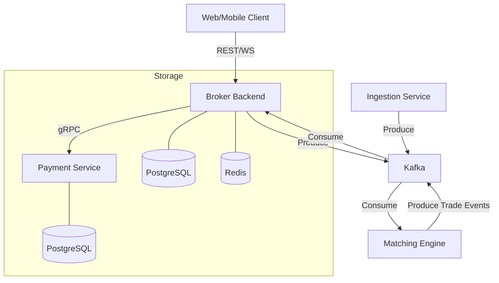

# 🏛️ Broker Application Architecture (Backend)

A high-performance, event-driven trading broker platform built with **Go 1.22+** and a modern microservices architecture. This system is designed for high availability, transactional integrity, and low-latency order matching.


---

## 🏗️ System Architecture

The platform is divided into specialized microservices that communicate via high-throughput Kafka topics and low-latency gRPC calls.



### 🛰️ Microservices Overview

*   **Core Broker Backend (`/broker-backend`)**
    *   **Gateways**: REST and WebSocket APIs for clients.
    *   **Wallet Domain**: Handles financial state with atomic precision (`DECIMAL(18,8)`). Uses PostgreSQL pessimistic locking to prevent race conditions during balance updates.
    *   **Order Management**: Implements the **Outbox Pattern** to ensure database state and Kafka events are perfectly synchronized.
*   **Matching Engine (`/matching-engine`)**
    *   Ultra-fast order book management.
    *   Matches buy/sell orders and generates execution reports.
    *   Event-driven processing via Kafka.
*   **Payment Service (`/payment-service`)**
    *   gRPC-based service for processing deposits and withdrawals.
    *   Integration with external payment gateways (Stripe, etc.).
    *   Manages its own transactional state for payment auditing.
*   **Ingestion Service (`/ingestion-service`)**
    *   Real-time market data harvester.
    *   Streams live price updates from external exchanges into Kafka.

---

## 🚀 Key Technologies & Design Patterns

| Category | Technology / Pattern | Rationale |
| :--- | :--- | :--- |
| **Language** | Go (Golang) | Superior concurrency, performance, and type safety. |
| **Architecture** | Clean Architecture | Strict separation of Domain, Use Case, and Infrastructure. |
| **Messaging** | Apache Kafka | Event sourcing and decoupling of critical services. |
| **Communication** | gRPC / Protocol Buffers | Efficient, type-safe inter-service communication. |
| **Integrity** | Outbox Pattern | Guaranteed "At Least Once" delivery of events. |
| **Performance** | `sqlx` & Redis | Raw SQL performance with optimized caching layers. |

---

## 📁 Project Structure

```text
.
├── broker-backend/       # Main API Gateway, Wallet & Order management
├── payment-service/      # gRPC service for financial transactions
├── matching-engine/      # High-speed order matching logic
├── ingestion-service/    # Real-time data feeds and market connectivity
└── Postman/              # API Documentation & Collections
```

---

## 🛠️ Getting Started

### 1. Prerequisites
- Docker & Docker Compose
- Go 1.22 or higher
- Postman (for API testing)

### 2. Infrastructure Setup
The core infrastructure (DBs, Cache, MQ) is orchestrated via Docker Compose within the `broker-backend` directory.

```bash
cd broker-backend
cp .env.example .env
docker-compose up -d
```

### 3. Running Services
Each service can be started independently. For example, to start the core backend:

```bash
cd broker-backend
go run cmd/server/main.go
```

---

## 🧪 Testing & API Documentation

- **Postman Collections**: Import the provided collections in the root folder (`Broker Backend APIs.postman_collection.json`) to test the REST endpoints.
- **Service Collections**: Check individual service directories (e.g., `payment-service`) for specific gRPC/REST collections.

## 🛡️ Security & Reliability
- **Transactional Safety**: All wallet operations are wrapped in strictly isolated database transactions.
- **Scalability**: All services are stateless and can be horizontally scaled using Kubernetes.
- **Observability**: Designed for easy integration with Prometheus/Grafana and ELK stack.

---
*Built with precision and performance in mind.*
