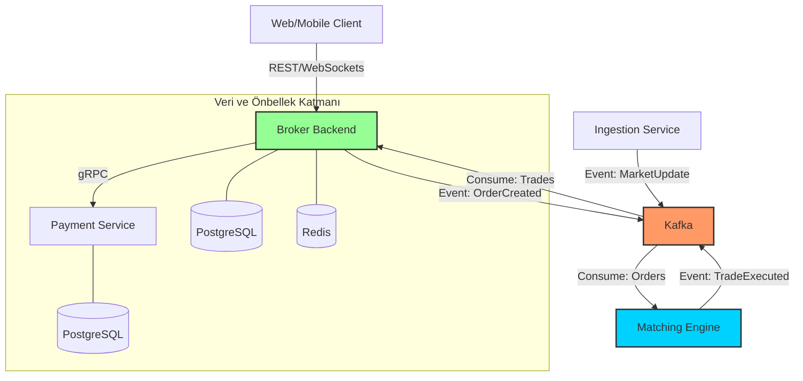

# 🏛️ TradeOff Backend: Mikroservis Mimarisi ve Yüksek Performanslı İşlem Sistemi

TradeOff backend ekosistemi, düşük gecikmeli emir eşleştirme, güvenli cüzdan yönetimi ve gerçek zamanlı veri işleme yeteneklerine sahip, **Go (Golang)** tabanlı bir mikroservis mimarisidir. Sistem, finansal işlemlerin doğruluğunu ve sistemin ölçeklenebilirliğini sağlamak için olay güdümlü (event-driven) bir tasarım kullanır.

---

## 🛰️ Sistem Mimarisi ve Veri Akışı

Sistem, yüksek hacimli işlemleri yönetebilmek için **Apache Kafka** üzerinden haberleşen, birbirinden bağımsız servislerden oluşur.



---

## 🛠️ Mikroservis Detayları

### 1. Broker Backend (`/broker-backend`)
Sistemin ana giriş noktasıdır.
- **Sorumluluklar:** Kullanıcı yönetimi (Auth), Cüzdan yönetimi, Emir girişi.
- **Teknik Detaylar:** `Clean Architecture` prensiplerine göre yapılandırılmıştır. PostgreSQL üzerinde **Pessimistic Locking** kullanarak bakiye tutarlılığını sağlar. **Outbox Pattern** ile veritabanı ve Kafka arasındaki veri senkronizasyonunu garanti eder.

### 2. Matching Engine (`/matching-engine`)
Sistemin beynidir; alım ve satım emirlerini milisaniyeler içinde eşleştirir.
- **Sorumluluklar:** Emir defteri (Order Book) yönetimi, Fiyat eşleştirme.
- **Teknik Detaylar:** Tamamen bellek içi (in-memory) veri yapıları ile çalışır ve Kafka üzerinden gelen emirleri asenkron olarak işler.

### 3. Payment Service (`/payment-service`)
Finansal dış dünya ile bağlantı noktasıdır.
- **Sorumluluklar:** Para yatırma/çekme işlemleri, gRPC tabanlı finansal servisler.
- **Teknik Detaylar:** Stripe gibi dış ödeme ağ geçitleri ile entegrasyona hazır gRPC arayüzleri sunar.

### 4. Ingestion Service (`/ingestion-service`)
Piyasa verisi sağlayıcısıdır.
- **Sorumluluklar:** Canlı fiyat verilerini dış borsalardan toplar ve sisteme aktarır.
- **Teknik Detaylar:** WebSocket stream'lerini dinleyerek Kafka üzerinden `MarketUpdate` olaylarını tetikler.

---

## 🚀 Teknolojik Yetkinlikler

| Alan | Teknoloji | Neden? |
| :--- | :--- | :--- |
| **Dil** | Go 1.22+ | Eşzamanlılık (Concurrency) desteği ve düşük bellek kullanımı. |
| **İletişim** | gRPC / ProtoBuf | Tip güvenli ve ultra hızlı servisler arası iletişim. |
| **Mesajlaşma** | Apache Kafka | Ölçeklenebilir ve dayanıklı olay akışı (event streaming). |
| **Veritabanı** | PostgreSQL 16 | ACID uyumluluğu ve karmaşık işlemsel bütünlük. |
| **Önbellek** | Redis 7 | Düşük gecikmeli oturum ve veri önbellekleme. |
| **Gözlemlenebilirlik** | Prometheus / Grafana | Sistem sağlığını gerçek zamanlı izleme (Dashboard hazır). |

---

## 📁 Proje Klasör Yapısı

```text
backend/
├── broker-backend/       # Gateway, Wallet & Order Domain
├── payment-service/      # gRPC tabanlı finansal işlemler
├── matching-engine/      # Yüksek hızlı emir eşleştirme mantığı
├── ingestion-service/    # Real-time veri besleme servisi
└── proto/                # Servisler arası gRPC tanımlamaları
```

---

## ⚡ Hızlı Başlangıç

### 1. Altyapı Hazırlığı
Docker Compose kullanarak gerekli tüm veritabanı ve kuyruk sistemlerini tek komutla başlatın:

```bash
cd broker-backend
cp .env.example .env
docker-compose up -d
```

### 2. Servislerin Çalıştırılması
Her servis bağımsız olarak çalıştırılabilir. Örnek (Broker Backend):

```bash
cd broker-backend
go run cmd/server/main.go
```

### 3. API Testleri
Root dizinindeki Postman koleksiyonunu (`Broker Backend APIs.postman_collection.json`) içe aktararak tüm uç noktaları test edebilirsiniz.

---

## 🛡️ Güvenlik ve Kararlılık İlkeleri

- **İşlemsel Bütünlük:** Tüm cüzdan hareketleri atomik işlemler (Atomic Transactions) ile korunur.
- **Hata Toleransı:** Kafka sayesinde bir servis geçici olarak dursa dahi, mesajlar kaybolmaz ve sistem geri geldiğinde kaldığı yerden devam eder.
- **Ölçeklenebilirlik:** Mikroservislerin her biri ihtiyaca göre Kubernetes üzerinde bağımsız olarak ölçeklenebilir.

---
*Built for scale, speed, and reliability.*
